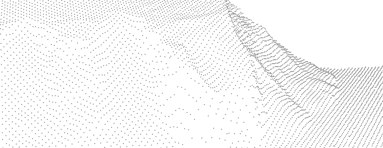
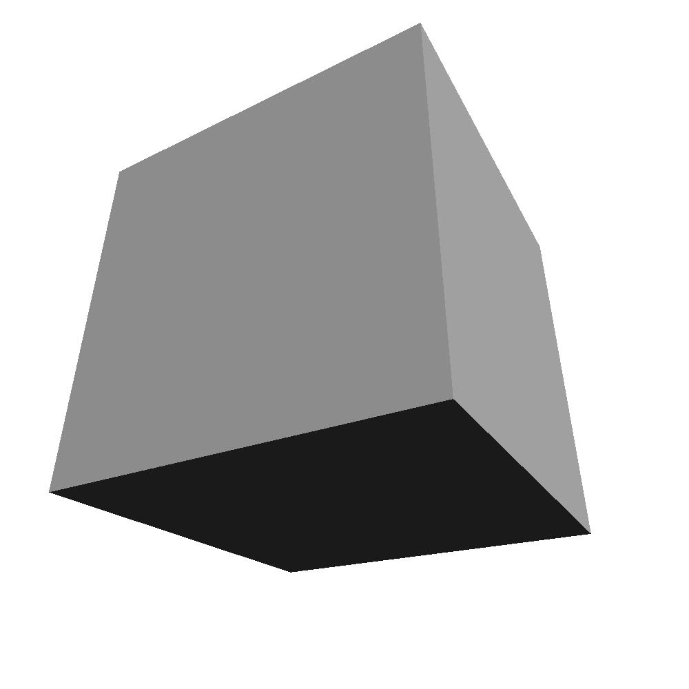
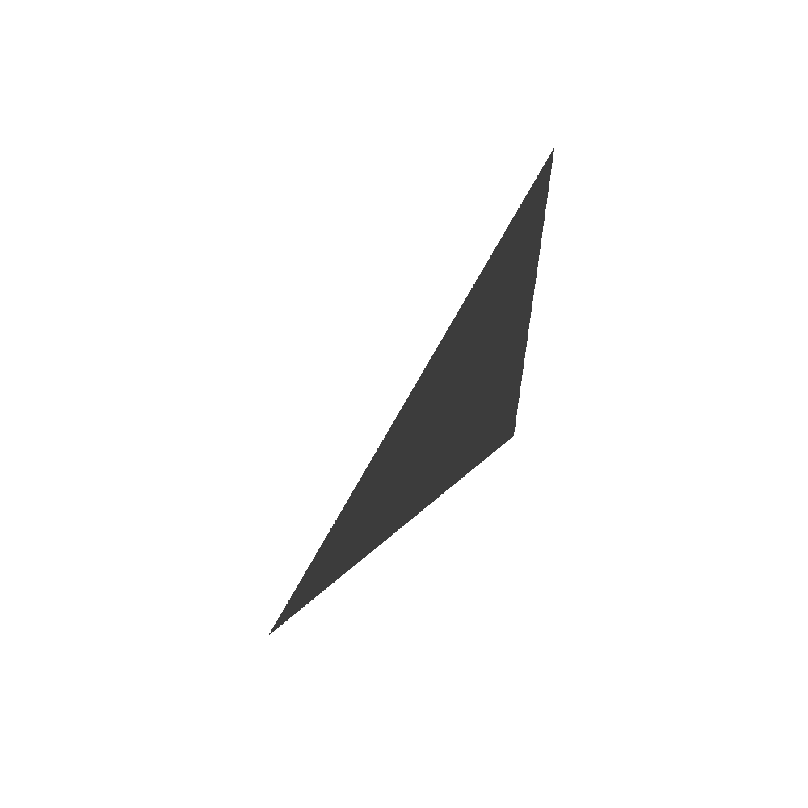
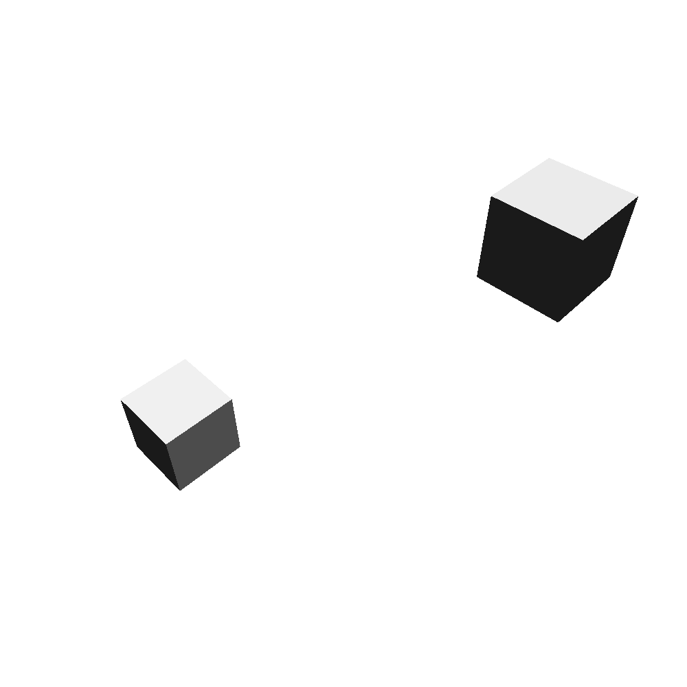
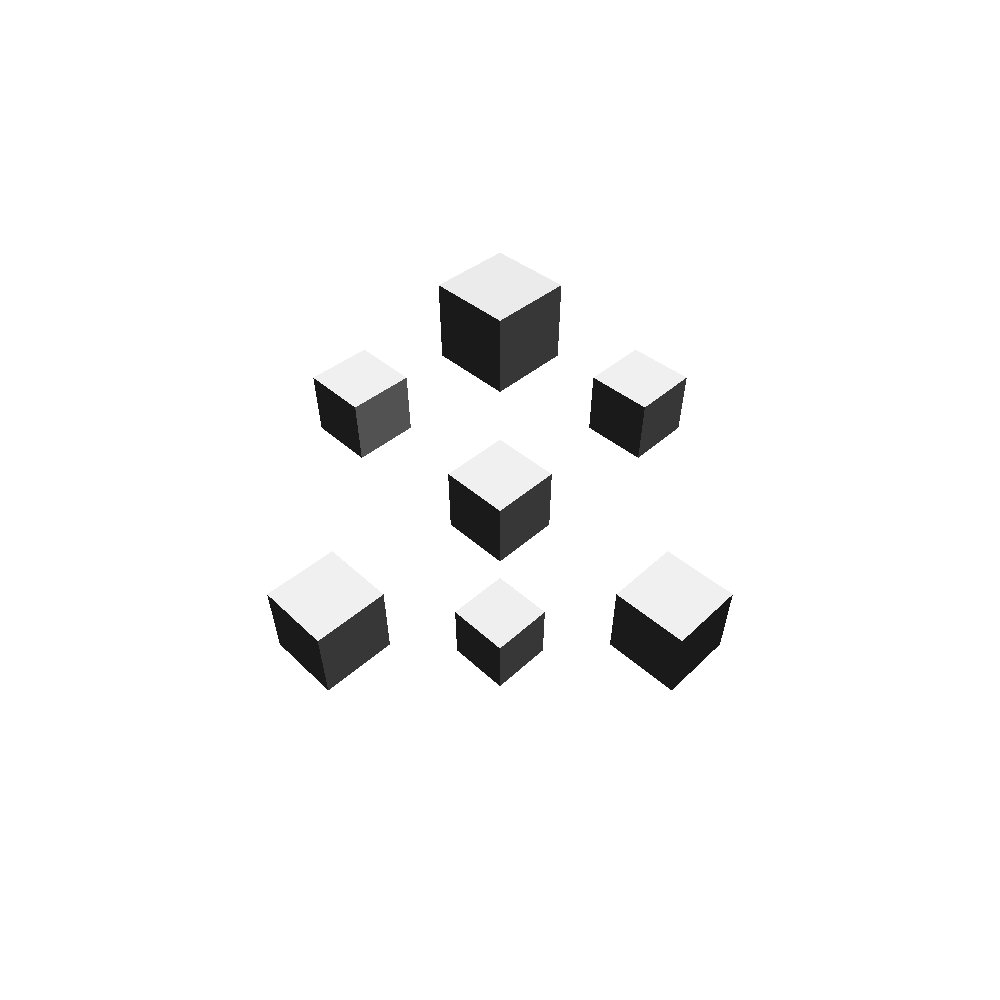
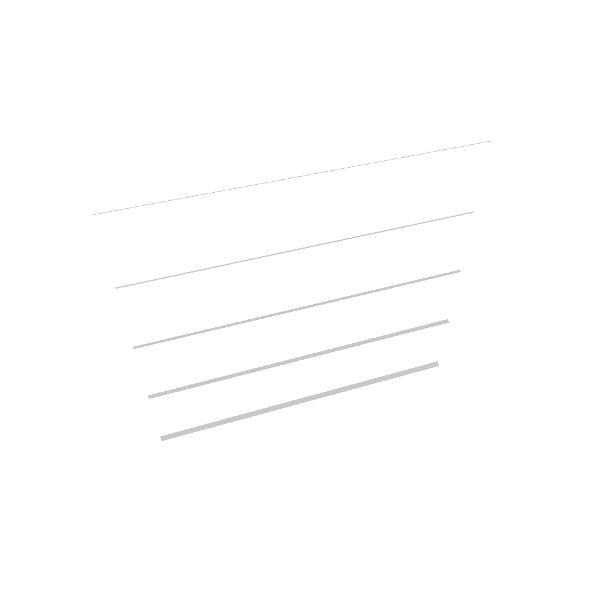
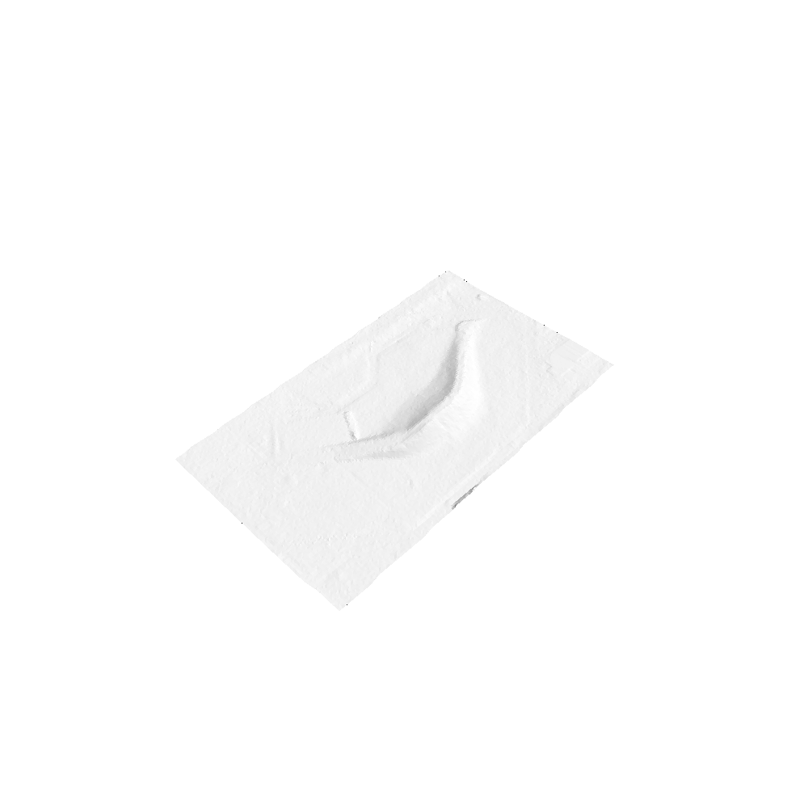
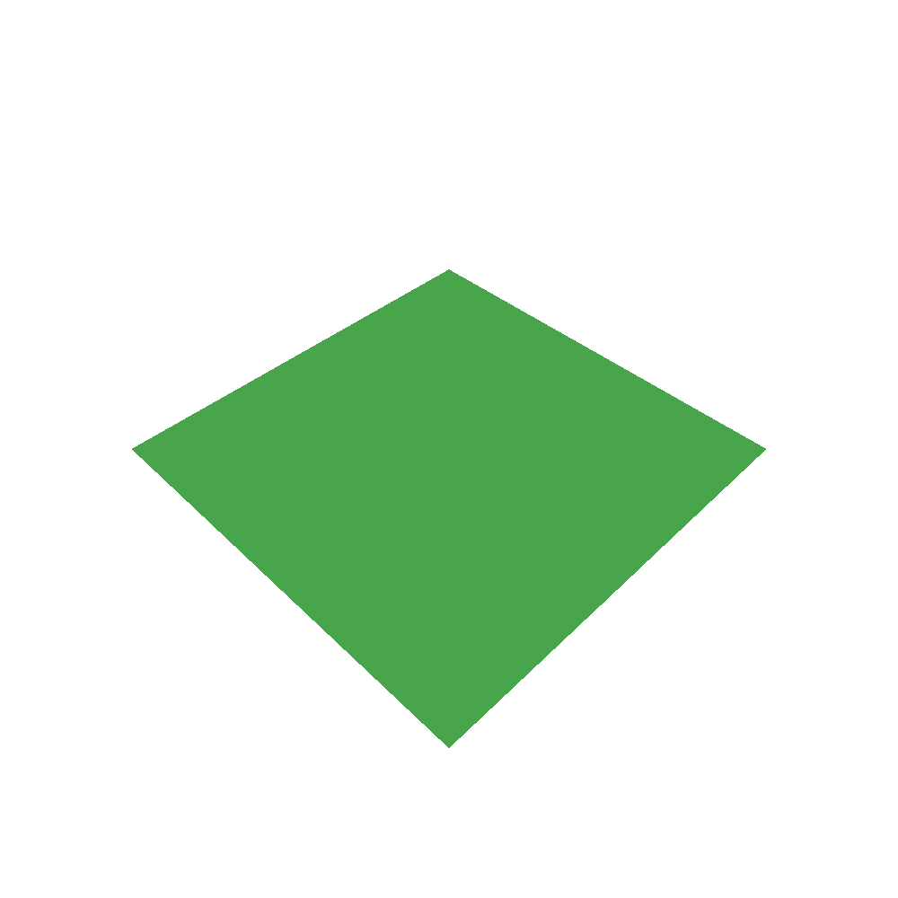
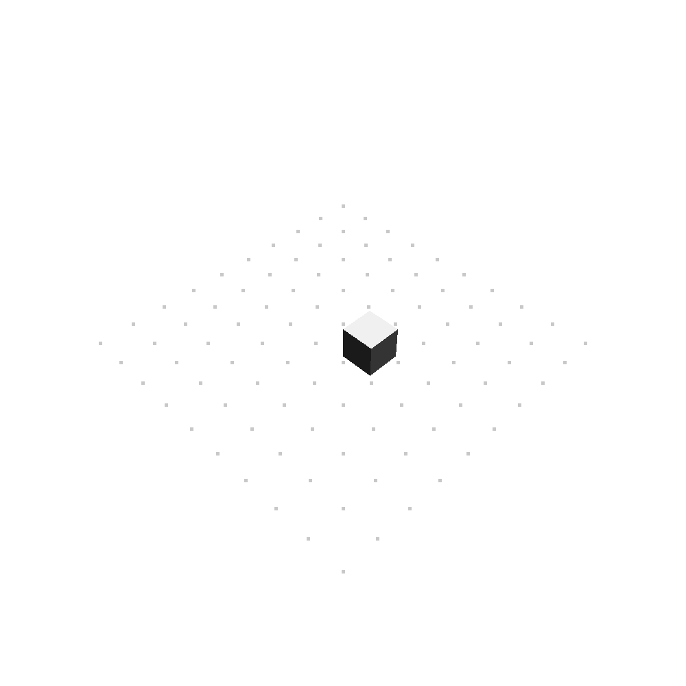
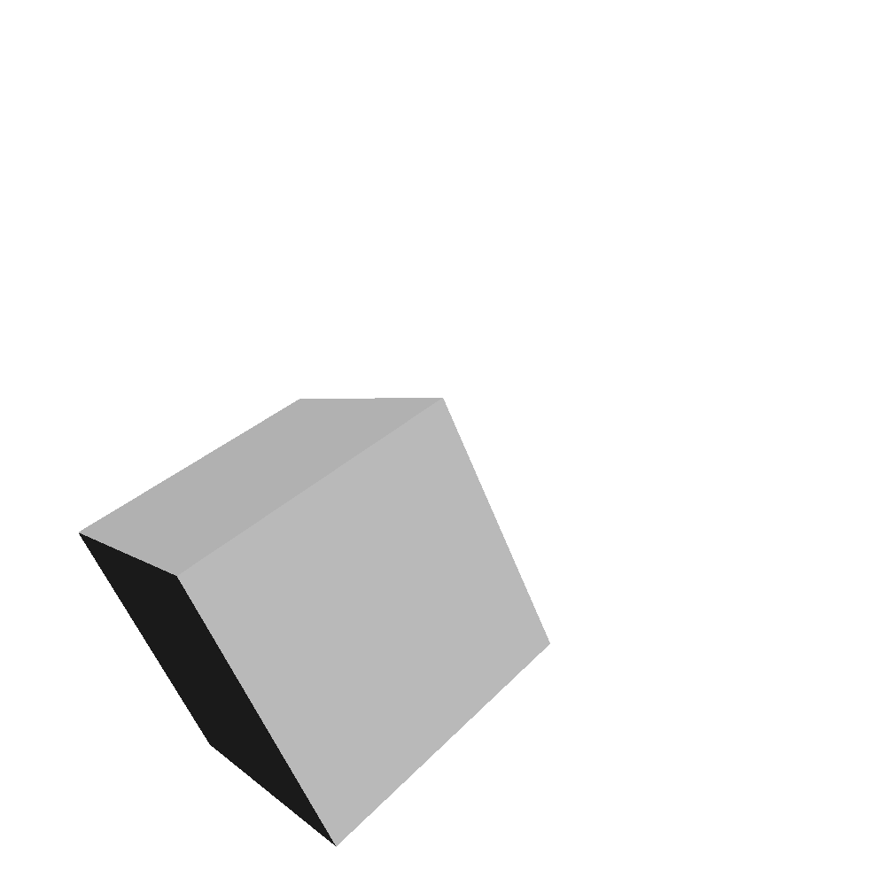

DiTreDi
===========

A flutter package that displays large 3D datasets on a transparent canvas.

[Live web example](https://jelenski.gitlab.io/ditredi/)

[Example source code](./example)

## Preface

DiTreDi was created to efficiently display datasets and meshes in 3D space. It wasn't intended to create a 3D game engine and is rather useful for displaying static meshes.

## Table of Contents

- [DiTreDi](#ditredi)
  - [Preface](#preface)
  - [Table of Contents](#table-of-contents)
  - [Getting started](#getting-started)
  - [Controller](#controller)
  - [Config](#config)
  - [Shapes](#shapes)
    - [Cube3D](#cube3d)
    - [Face3D](#face3d)
    - [Group3D](#group3d)
    - [Line3D](#line3d)
    - [Mesh3D](#mesh3d)
    - [Plane3D](#plane3d)
    - [Point3D](#point3d)
    - [PointPlane3D](#pointplane3d)
  - [Transformations](#transformations)
    - [Points and wireframes](#points-and-wireframes)
    - [Matrix transformation](#matrix-transformation)
  - [Benchmarks](#benchmarks)

## Getting started

[Install package](https://pub.dev/packages/ditredi/install).

Add imports for `ditredi` and `vector_math`:

```dart
import 'package:ditredi/ditredi.dart';
import 'package:vector_math/vector_math_64.dart';
```

Add `DiTreDi` widget to your tree:

```dart
DiTreDi(
    figures: [
        Cube3D(2, Vector3(0, 0, 0)),
    ],
)
```

And voilà, single cube will be displayed:


> Note: `DiTreDi` takes full available size. Wrap in `SizedBox` or `Expanded` to control its constraints and size.

## Controller

`DiTreDiController` controls a scene rotation, scale, light.

To setup controller, keep its reference in a state and pass to `controller` parameter.

```dart
// in a state
@override
void initState() {
    super.initState();
    controller = DiTreDiController();
}

DiTreDi(
    figures: [
        Cube3D(2, Vector3(0, 0, 0)),
    ],
    controller: controller,
)
```

Once ready, update controller state by calling:

```dart
controller.update(rotationY: 30, rotationX: 30);
```



To handle input gestures use `GestureDetector` or `DiTreDiDraggable`:

```dart
DiTreDiDraggable(
    controller: controller,
    child: DiTreDi(
        figures: [Cube3D(1, vector.Vector3(0, 0, 0))],
        controller: controller,
    ),
);
```

## Config

`DiTreDiConfig` defines component "defaults" - mesh color, lines and points width (if not specified).

```dart
// in a state

DiTreDi(
    figures: [
        Cube3D(2, Vector3(0, 0, 0)),
    ],
    config: DiTreDiConfig(
        supportZIndex: false,
    ),
)
```

If a huge dataset is displayed and you don't bother about paint order, it's recommended to disable z-index which boosts drawing speed (`supportZIndex = false`).

## Shapes

`DiTreDi` out-of-the-box supports shapes like:

### Cube3D

Just a cube.

```dart
DiTreDi(
    figures: [
        Cube3D(2, Vector3(0, 0, 0)),
    ],
)
```


### Face3D

Face (aka triangle).

```dart
DiTreDi(
    figures: [
        Face3D(
            Triangle.points(
                Vector3(0, 0 - 1, 0 - 1),
                Vector3(0, 0 - 1, 0 + 1),
                Vector3(0, 0 + 1, 0 + 1),
            ),
        ),
    ],
)
```



### Group3D

Groups a list of figures.

```dart
DiTreDi(
    figures: [
        Group3D([
            Cube3D(1, Vector3(0, 0, 0)),
            Cube3D(1, Vector3(3, 3, 3)),
        ]),
    ],
)
```



An alternative method to display multiple shapes, it to put a few `figures`:

```dart
DiTreDi(
    figures: [
        Cube3D(1, Vector3(0, 0, 0)),
        Cube3D(1, Vector3(-3, 0, 0)),
        Cube3D(1, Vector3(3, 0, 0)),
        Cube3D(1, Vector3(0, -3, 0)),
        Cube3D(1, Vector3(0, 3, 0)),
        Cube3D(1, Vector3(0, 0, -3)),
        Cube3D(1, Vector3(0, 0, 3)),
    ],
)
```



### Line3D

A line.

```dart
DiTreDi(
    figures: [
      Line3D(Vector3(0, 1, 0), Vector3(2, 1, 4), width: 8),
      Line3D(Vector3(0, 2, 0), Vector3(2, 2, 4), width: 6),
      Line3D(Vector3(0, 3, 0), Vector3(2, 3, 4), width: 4),
      Line3D(Vector3(0, 4, 0), Vector3(2, 4, 4), width: 2),
      Line3D(Vector3(0, 5, 0), Vector3(2, 5, 4), width: 1),
    ],
)
```



### Mesh3D

A mesh made of faces (triangles).
You could use `ObjParser` to load it from .obj file contents.
Currently only material (mtl) as colors are supported.

```dart
DiTreDi(
    figures: [
        Mesh3D(await ObjParser().parse(meshLines));
    ],
)
```

```dart
DiTreDi(
    figures: [
        Mesh3D(await ObjParser().loadFromResources("assets/model.obj"));
    ],
)
```

```dart
DiTreDi(
    figures: [
        Mesh3D(await ObjParser().loadFromFile(File("files/model.obj")));
    ],
)
```




### Plane3D

Plane facing x, y or z axis.

```dart
DiTreDi(
    figures: [
        Plane3D(5, Axis3D.y, false, Vector3(0, 0, 0), color: Colors.green),
    ],
)
```



### Point3D

A point (exactly a square).

```dart
DiTreDi(
    figures: [
        Plane3D(5, Axis3D.y, false, Vector3(0, 0, 0), color: Colors.green),
    ],
)
```


### PointPlane3D

Plane made of points (e.g. to show an object) scale.

```dart
DiTreDi(
    figures: [
      PointPlane3D(1, Axis3D.y, 0.1, Vector3(0, 0, 0), pointWidth: 5),
      Cube3D(0.5, Vector3(0, 0, 0)),
    ],
)
```



## Transformations

### Points and wireframes

Each figure could be transformed to points or lines (wireframe).

```dart
DiTreDi(
    figures: [
      ...Plane3D(5, Axis3D.z, false, Vector3(0, 0, 0)).toPoints(),
    ],
)
```

```dart
DiTreDi(
    figures: [
      ...Plane3D(5, Axis3D.z, false, Vector3(0, 0, 0)).toLines(),
    ],
)
```


### Matrix transformation

Figures might be rotated, translated and scaled with `TransformModifier3D` and `Matrix4`.

Each transformation is made for `0,0,0` coordinates.

```dart
DiTreDi(
    figures: [
        TransformModifier3D(
            Cube3D(2, Vector3(1, 1, 1)),
            Matrix4.identity()
              ..setRotationX(10)
              ..setRotationY(10)
              ..setRotationZ(10)),
    ],
)
```



To rotate figure around its "own" position, you must translate, rotate and translate back.

```dart
DiTreDi(
    figures: [
        Cube3D(2, Vector3(0, 0, 0)),
        TransformModifier3D(
            Cube3D(2, Vector3(2, 2, 2)),
            Matrix4.identity()
              ..translate(2.0, 2.0, 2.0)
              ..rotateZ(10)
              ..rotateX(10)
              ..translate(-2.0, -2.0, -2.0)),
    ],
)
```


Transform `Group3D` to apply matrix to each figure.

```dart
DiTreDi(
    figures: [
        Cube3D(2, Vector3(0, 0, 0)),
        TransformModifier3D(
          Group3D([
            Cube3D(2, Vector3(2, 2, 2)),
            Cube3D(2, Vector3(4, 4, 4)),
          ]),
          transformation,
        ),
    ],
)
```


## Benchmarks

TBD